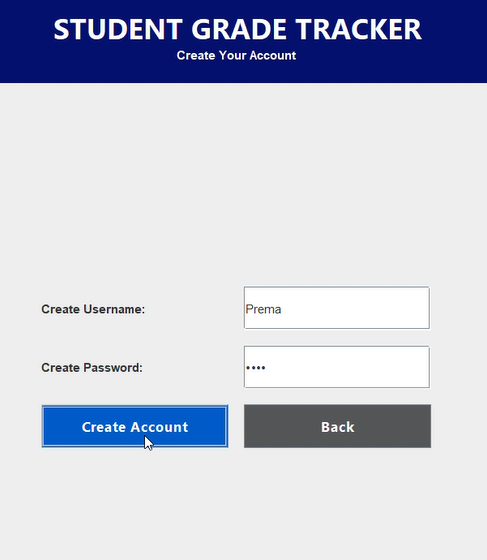
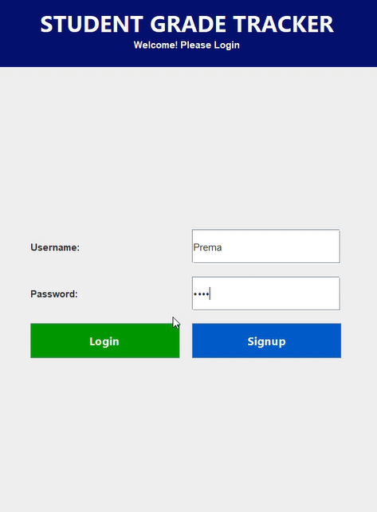
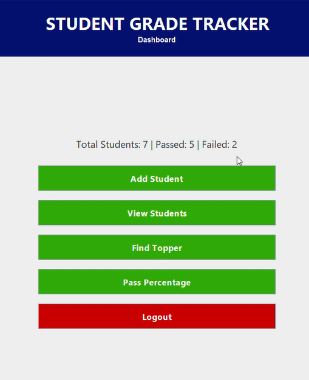
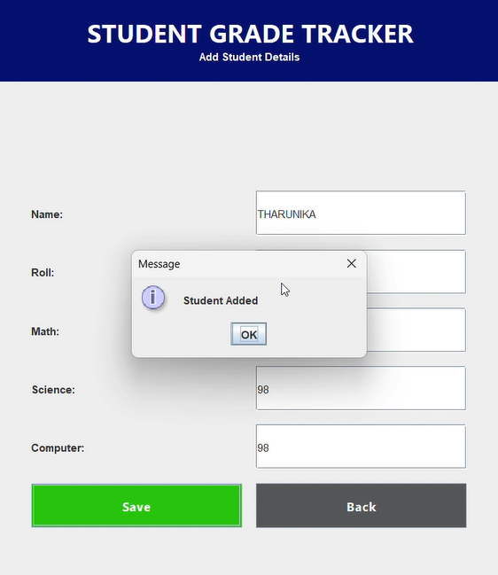
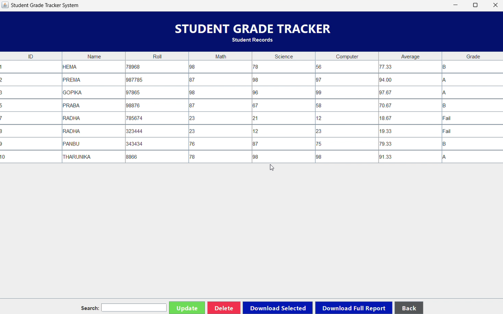
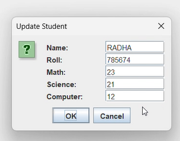
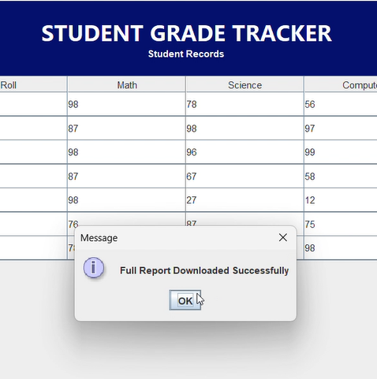
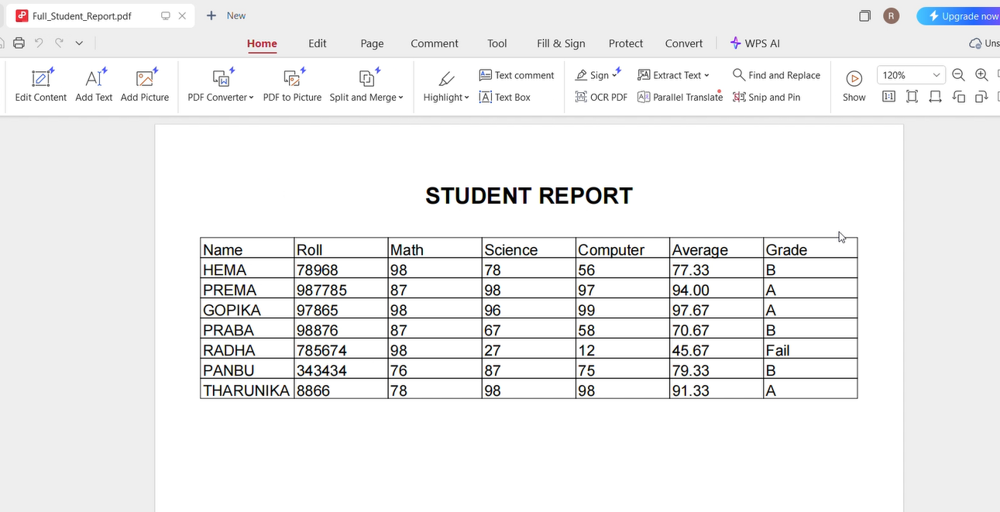
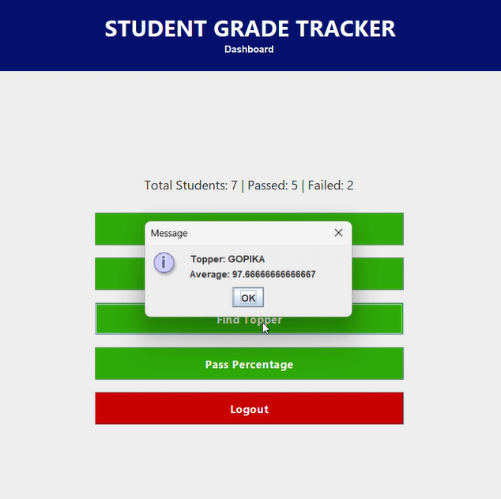
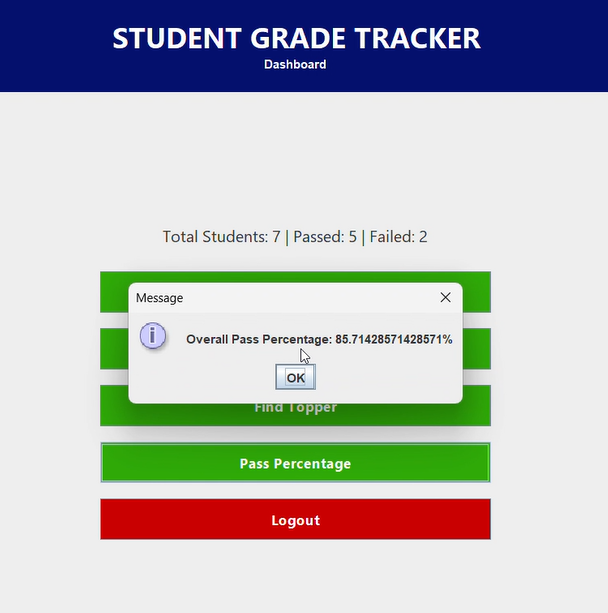

# 🎓 Student Grade Tracker (Java Desktop Application)

A professional desktop-based Student Grade Management System built using **Java Swing**, **SQLite**, and **iText PDF**.

This application allows users to manage student academic records with authentication, CRUD operations, statistics tracking, and PDF report generation.

---

## 🚀 Features

### 🔐 Authentication System
- User Signup
- User Login
- Secure credential validation using SQLite

### 👩‍🎓 Student Management (CRUD)
- Add Student
- View Students in table format
- Update student details
- Delete student records
- Unique Roll Number validation

### 📊 Academic Analytics
- Find Topper
- Calculate Overall Pass Percentage
- Automatic Grade Calculation (A / B / C / Fail)
- Average calculation per student

### 🔍 Search & Filter
- Real-time search filter in report table
- Sortable columns

### 📄 PDF Report Generation
- Download Selected Student Report (Tabular format)
- Download Full Student Report (All students in table format)
- Professional formatted PDF with header

### 🎨 User Interface
- Clean professional UI using Java Swing
- Color-coded buttons:
  - 🟢 Login (Green)
  - 🔵 Signup (Blue)
  - 🟩 Dashboard buttons (Light Green)
  - 🔴 Logout (Red)
- Structured header on all pages

---
## 📸 Screenshots
### Sign up

### 🔐 Login Page

### 📊 Dashboard

### ➕ Add Student

### 📑 View Student Report

- Update Student Details

### 📄 PDF Output

## Find Topper

## Pass Percentage

---

## 🛠 Technologies Used

- Java (Core + OOP Concepts)
- Java Swing (GUI)
- SQLite (Database)
- JDBC (Database connectivity)
- iText PDF (Report generation)
- IntelliJ IDEA

---

## 🗄 Database Structure

### users table
| Column | Type |
|--------|------|
| id | INTEGER (PK) |
| username | TEXT (UNIQUE) |
| password | TEXT |

### students table
| Column | Type |
|--------|------|
| id | INTEGER (PK) |
| name | TEXT |
| roll | INTEGER (UNIQUE) |
| math | INTEGER |
| science | INTEGER |
| computer | INTEGER |

---

## 📂 Project Structure

Student-Grade-Tracker:
  - DBConnection.java
  - StudentGradeTrackerGUI.java
  - students.db (auto generated)
  - README.md
  - lib/ (iText jar files)

---
